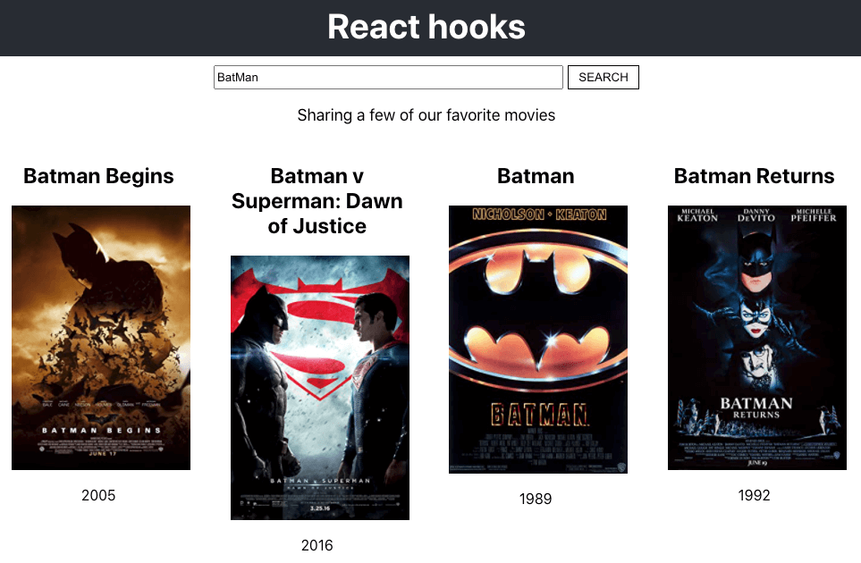
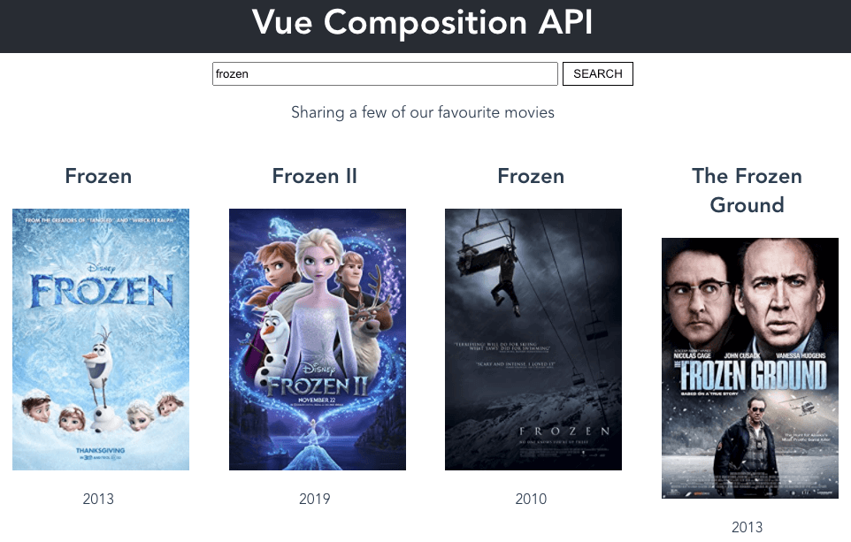

## Hooks Compare

Implement a simple movie searcher app to compare the differences between React Hooks and Vue Composition API.

This project leverages the power of [Vite](https://github.com/vitejs/vite) to build the boilerplate.

## Preview

react hooks version



vue composition api version



## Usage

choose your version:

- [vue composition api version](https://github.com/Ericteen/hooks-compare/tree/main/vue-movie-searcher)
- [react hooks version](https://github.com/Ericteen/hooks-compare/tree/main/react-movie-searcher)

```sh
$ git clone https://github.com/Ericteen/hooks-compare
$ cd react-movie-searcher
$ yarn
$ yarn run dev
```

## License

MIT